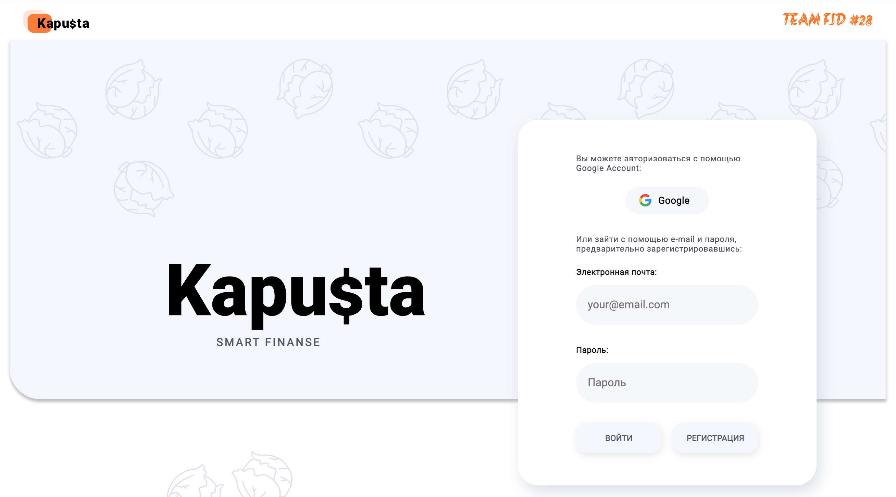
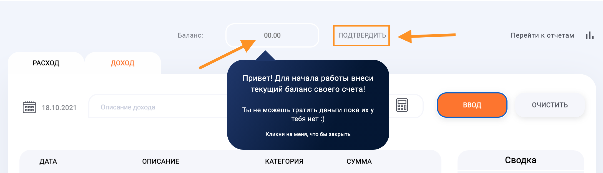
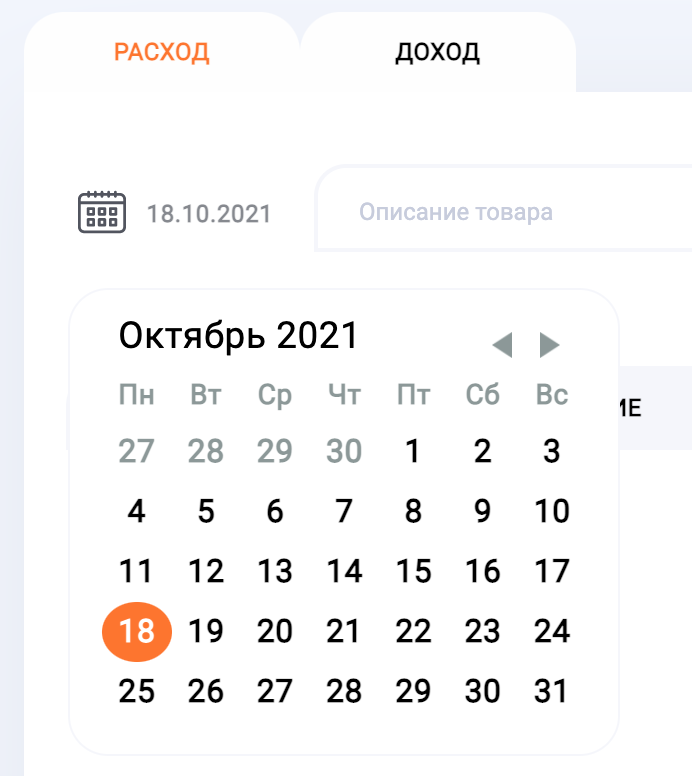
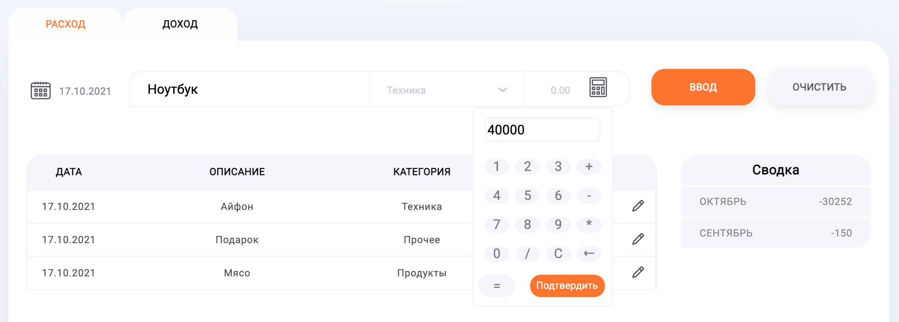
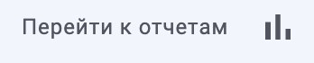
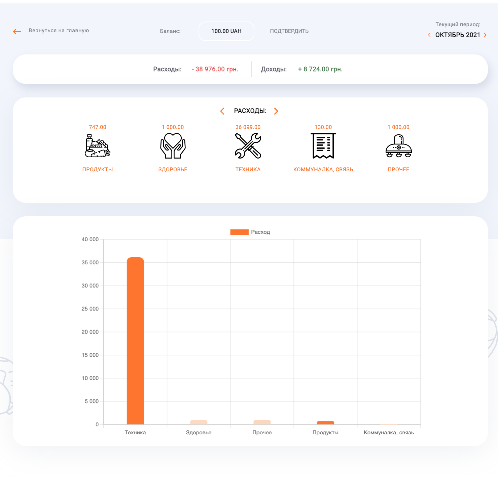
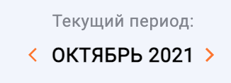

# team-project-kapusta-app

<h1 align="center"> :technologist: :books: :fire: GoIT Team project :rocket: :rocket: :rocket:</h1>
<h2 align="center"> :leafy_green: :moneybag: Kapu:heavy_dollar_sign:sta – your smart finance :moneybag: :money_with_wings:</h2>

<h2 align="center"><a  href="https://kapusta-fsd28.netlify.app/">Application page </a></h2>
<h2 align="center"><a  href="https://kapusta-api.herokuapp.com/api-docs/#/">API server</a></h2>

## Description

Graduation team project of students the FullStack developer course
.

<b>Frontend</b> is written on

with using
.

<b>Backend</b> is written on

with using
,

and

## How to use Kapu$ta App

is the Web app for calculating your finances.

**The Web App provides the following functions:**

:moneybag: Keep track of your expenses and income.

:technologist: Keep your records for the entire period.

:green_circle: User authorization via Gmail and registration with two factor
authentication via email.

:money_with_wings: Create statistics of expenses and incomes for the selected
period.

:chart: Plot statistics by category and subcategory.

:black_circle: Responsive design for use on phone :iphone:, tablet and desktop
:desktop_computer:.

## Before start

After first time authorisation you should enter initial balance.

Then just choose date , name of
expenses or income, category and enter the sum
.

To check you statistic just put the link
 and you will find your statistic
for current period.  To choose
period just change to left or right
.

## Developers

-  -
  **Dream Team Lead**
- -
  **"Scream" Master**
-  -
  **Redux Queen**
-  -
  **Creative director**

-  -
  **Component Rescue Superhero**

-  -
  **Component Rescue Superhero**

-  -
  **Senior Developer of Login Page**

- -
  **Material-UI expert**
